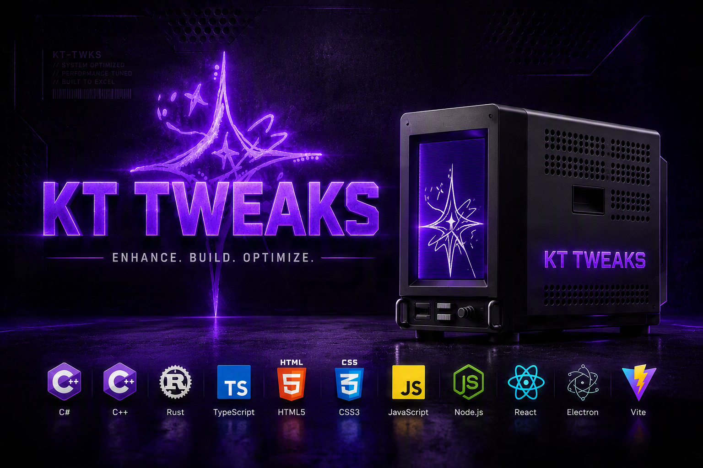

# KT TWEAKS

### ENHANCE. BUILD. OPTIMIZE.

**Otimização de Windows de nível profissional. Codigo aberto, transparente e auditável.**

---

## O que fazemos

Ferramentas que modificam o Windows com privilégio de **TrustedInstaller** — mas com transparência total: código aberto, auditoria de cada playbook e ferramentas dedicadas para quem cria.

### Projetos principais

| Projeto | Descrição |
|---------|-----------|
| **[KT-WIRZADE](https://github.com/KT-TWEAKS/KT-WIRZADE)** | Motor de otimização por playbooks `.apbx` (YAML + 7z): rollback real, IPC seguro, modo ISO/USB, multiplaybook, multi-idioma PT-BR/EN — *em desenvolvimento, primeiro release em breve* |
| **[APBX Developer]** (incluído no pacote) | Análisa playbooks sem aplicar — classifica 20 tipos de ação, detecta riscos, exporta relatório |
| **[APBX DevKit]** (incluído no pacote) | IDE para criar playbooks — valida com o mesmo parser do motor, compila `.apbx` em 1 clique |
| **[KT-TWEAKS-APBX](https://github.com/KT-TWEAKS/KT-TWEAKS-APBX)** | Playbooks oficiais KT TWEAKS — verificados pela equipe, base de referência pra criação |

### Stack

`C#` · `.NET 4.8` · `WPF` · `PowerShell` · `C/C++` · `Rust` · `TypeScript` · `HTML5` · `CSS3` · `JavaScript` · `Node.js` · `React` · `Electron` · `Vite`

---

> **"Enhance. Build. Optimize."**
>
> Otimização não precisa ser caixa-preta. Toda a lógica é auditável, testável e reversível.

